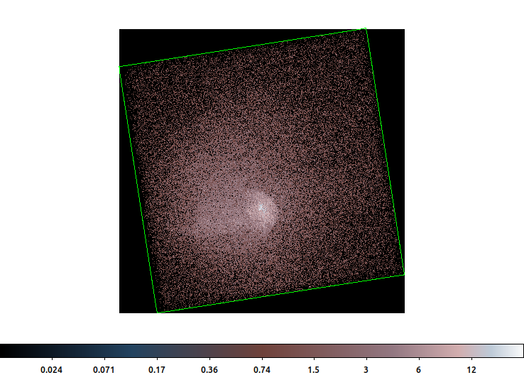
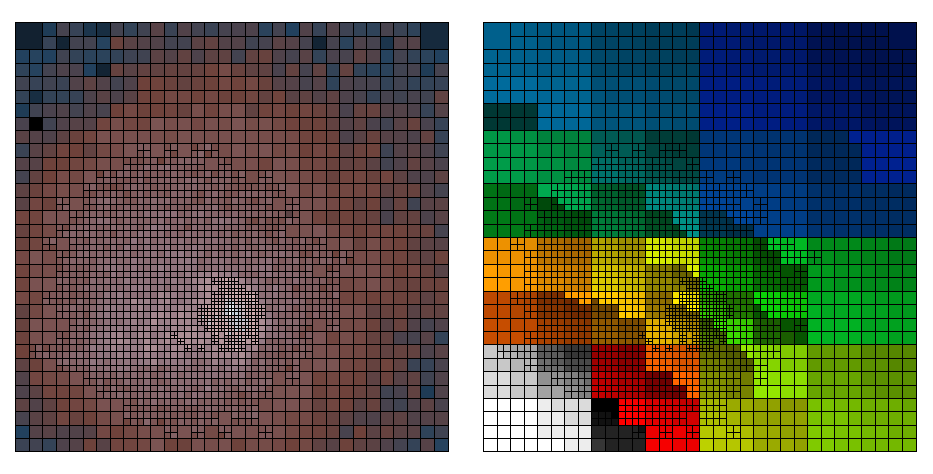
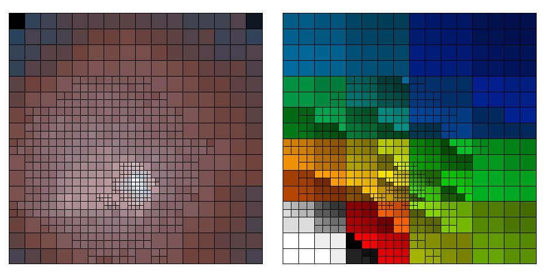
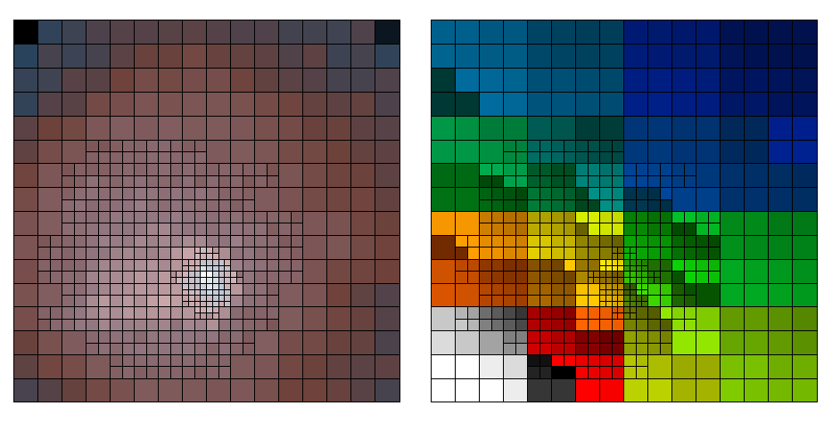
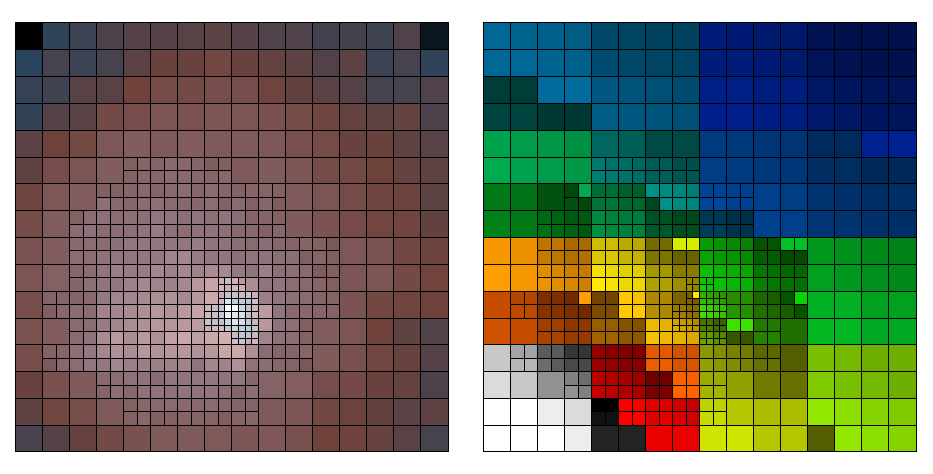

# `dmnautilus`

## Overview

The quad-tree algorithm used by `dmfilth` is available in the
[help file](https://cxc.cfa.harvard.edu/ciao/ahelp/dmnautilus.html).
There is an updated help file, `dmnautilus.xml` in the `src` folder.


## Example

Consider an image of Abell 1775, OBS_ID=13510.  



This the 0.5-7.0 keV counts image, imaged with ACIS-7, where the 
point-like sources have been removed.  The full image will be cropped
to exclude the corners where there are no counts/exposure.

### The original algorithm, `method=0`


```bash
dmnautilus \
  infile=img.fits \
  outfile=dmnautilus/img.abin \
  snr=10 \
  method=0 \
  outmask=dmnautilus/img.map \
  outsnr=dmnautilus/img.snr \
  outarea=dmnautilus/img.area \
  mode=h clob+
```



The output from `dmnautilus` with `method=0`.  _(Left)_ the counts image
adaptively binned with a SNR threshold of 10. This means that the image 
keeps being divided until the SNR in each of the sub-image is less than 100 
counts.  _(Right)_ the map (`outmask`) file showing which pixels are grouped 
together.

### The updated algorithm

The results for the updated algorithm are shown below for the
same image and SNR=10 threshold


| `method` | Output                                            |
|----------|---------------------------------------------------|
|   0      |    |
|   1      | |
|   2      | |
|   3      | |
|   4      | |


If you look carefully at the results for different `method` values, you
will see that the rectangles describing the grid become larger as the 
method value increases.  With `method=4`, all the rectangles now must 
meet the SNR=10 threshold (ie have 100 counts).


## Changes

This code was originally forked from CIAO 4.6; however, there have been
minimal updates since then.  The only upstream update was to add units 
to the output which have been included.


### I/O

This code replaces the image I/O routines with the `dmimgio` library.
This is needed because one of the problems with the original was that
it did not keep track of which pixels were outside the image subspace 
(or were NaN/Nulls).  The `dmimgio` lib provide this functionality.

### `method` parameter

Introduction of the `method` parameter.  With `method=0` the original
algorithm is used (see `GlobalSplitCriteria`), that is the current level 
is split into 2x2 if its SNR is > threshold

The new algorithm is triggered when `method=1|2|3|4`.  The value indicates
the number of the sub 2x2 arrays that must have SNR> threshold to trigger
the split. With `method=2`, the two must be side-by-side, not diagonal.
With `method=4`, all the sub-images are required to be above the SNR
threshold.

If any of the sub-image is fully outside the subspace or only contains
NULL/NaN values, then that sub-image is treated as if the SNR is > threshold.
There is no adjustment for sub-images partially outside the subspace|NULL|NaNs.

### `rectangles`

The original hacky way to use the Cdelt values doesn't work. There are 
cases where the regions overlap which is bad.

So instead of using a box, we use a rectangle since the edge points are 
explicitly specified.


## Build

### CXC-style Makefiles

These instructions are only for internal CXC usage.
Users need to have the CIAO binaries and the source code tree
installed, eg in your view.

```bash
ciao
git clone https://github.com/kglotfelty/dmnautilus/
cp dmnautilus/src/* $ASCDS_INSTALL/src/da/analysis/dmtools/dmnautilus/
cp dmnautilus/test/*.t $ASCDS_INSTALL/src/da/analysis/dmtools/dmnautilus/
cd $ASCDS_INSTALL/src/da/analysis/dmtools/dmnautilus
/bin/rm Makefile.in Makefile.am
mv Makefile.cxc Makefile
make install
```

### Stand alone

1. Users must have CIAO 4.13 installed.
    - If using `ciao-install`: the binary `core` and `tools` packages 
      need to be installed. You do not need to have the source code
      packages installed.
    - If using `conda`: only the `ciao` packaged needs to be installed.
2. User must install the `dmimgio` library first.
```bash
ciao
git clone https://github.com/kglotfelty/dmimgio
cd dmimgio
./configure --perfix=$ASCDS_INSTALL
make
make install
```
3. Install `dmnautilus`
```
git clone https://github.com/kglotfelty/dmnautilus
cd dmnautilus
./configure --prefix=$ASCDS_INSTALL
make
make check
make install
```
If `make` fails with an error about running `aclocal`, then you may need run
```bash
./autogen.sh
```
first.


## Communication log


### 01 July 2014

_From_: D.B.

_To_: dsdevel

 Two local users asked if there was a way to make `dmnautilus` only do
the split if the four quadrants each have a SNR greater than the snr
parameter; the current behavior is to split a cell if its SNR is
greater than the limit, but this is not useful if you want the final
set of cells to have a minimum SNR.

I would imagine it would be a case of adding some sort of a flag
parameter to determine whether to use the current method or the new
one.

The users actually started looking into modifying `dmnautilus` itself to
do this - after we told them how to do this - but then ended up going
with using some code ... probably http://www.mpe.mpg.de/~jsanders/adbin/

### 01 July 2014
_From_: W.M.

_To_: dsdevel

Added this RFE to the bug tracker as:

> #13929: RFE: dmnautilus to have a mode where the split is only done if
>     all the quadrants have snr>min val 

### 05 June 2015
_From_: K.G.

_To_: W. McLaughlin.


I have been prototyping D's `dmnautilus` RFE from last year #13929.

The basic idea of the current version of `dmnautilus` is this:

It starts with the whole N x M image.  It computes the SNR of the image pixel
values.  If the SNR is above the input threshold it divides the image into four
N/2 x M/2 sub-images (truncate/ceiling as needed).   For each of those four, the
SNR is checked.  If the SNR is above the threshold then that sub-image is
further sub-divided.  This repeats until the SNR is below the threshold in all
the sub-images -- or there is only 1 pixel left.

The change is to invert the logic -- instead of setting what amounts to a
maximum SNR threshold, we want to set a minimum threshold.  The idea being we
want to divide the image so that each sub-image has at least a certain SNR, ie
so-many counts. The current algorithm gives us sub-images with at-most a
certain SNR.

So starting with our N x M image.  We compute the SNR in all four of the N/2 x
M/2 sub-images first.  If the SNR in all 4 of them is above the limit, then the
NxM image is split, and each of the 4 sub-images is then further
sub-divided/checked/etc.

The problem with this algorithm is that the useful part of the image may not
extend all the way to the edge of the image.  For example if data have a 45
degree roll, then the image space is rotated and there are lots of pixels with a
value = 0 around the edge.  All these 0's can make it hard to meet the SNR
criteria so the region around the edge of the image tends not to get split.

There are two things that help deal with this in this prototype:

First, the code now uses the `dmimgio` routines -- a LOCAL_LIB used by other
`dmimg*` tools that keeps track of which pixels are outside the image subspace
and/or are Null/NaN.  If the sub-image is entirely outside the
subspace/mask/NaN/Null, then the SNR check passes for that sub-image.

Second, instead of just requiring all 4 sub-images to be above the SNR threshold
to split, the number that must be above threshold is the 'method' parameter.  A
value of 4 requires all 4 sub-images be above threshold.  3 -- any 3 of the
sub-images.  2 -- any adjacent (ie not diagonal) sub images, and 1 -- any
single.  The value of 0 is the original algorithm -- none of the sub-images
should be above the threshold.

I have my prototype code in:

https://github.com/kglotfelty/dmnautilus.git     (ed.)

The current regression tests will continue to pass (when the new 'method=0'
parameter is set).  There are also several new tests with local copies of the
input files and a save'd file in subdirs.  (See new_four for example where edges
are especially problematic.)

There are also a few other code changes to clean up and add extra comments in
places.  I think the only other functional change is that the regions are now
written as rectangles instead of boxes to deal with a WCS shift I was seeing.

...snip...
